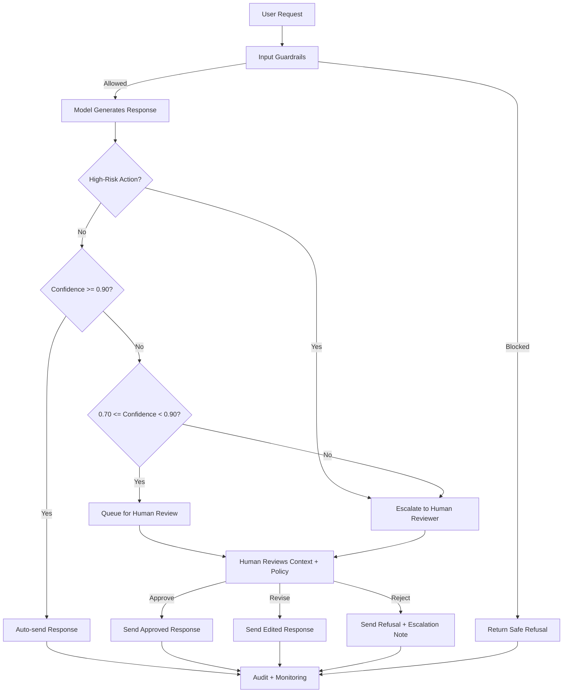

# HITL Flowchart

## Title
Human-in-the-Loop Decision Flow for VinBank Assistant

## 1. Flow Diagram

## 2. Decision Points

### Decision Point 1: High-Value Transfer Approval
- Trigger: transfer above threshold or to a new beneficiary
- HITL model: human-in-the-loop
- Context needed: recipient details, amount, account history, login/device risk, model confidence
- Example: transfer 250,000,000 VND to a newly added account

### Decision Point 2: Identity and Account Changes
- Trigger: password reset, KYC update, account ownership or profile change
- HITL model: human-on-the-loop
- Context needed: identity verification signals, attempted fields, full audit trail
- Example: phone and email change right after lost-device report

### Decision Point 3: Ambiguous or Policy-Sensitive Complaints
- Trigger: fraud claims, legal liability, disputed transactions, policy ambiguity
- HITL model: human-as-tiebreaker
- Context needed: conversation history, related transactions, policy references
- Example: customer claims ATM withheld cash and requests immediate reimbursement

## 3. Escalation Rules
- Always escalate high-risk banking operations, regardless of confidence.
- Auto-send only when confidence is high and risk is low.
- Use queue review for medium confidence outputs.
- Log every escalation, approval, edit, and rejection in audit records.
